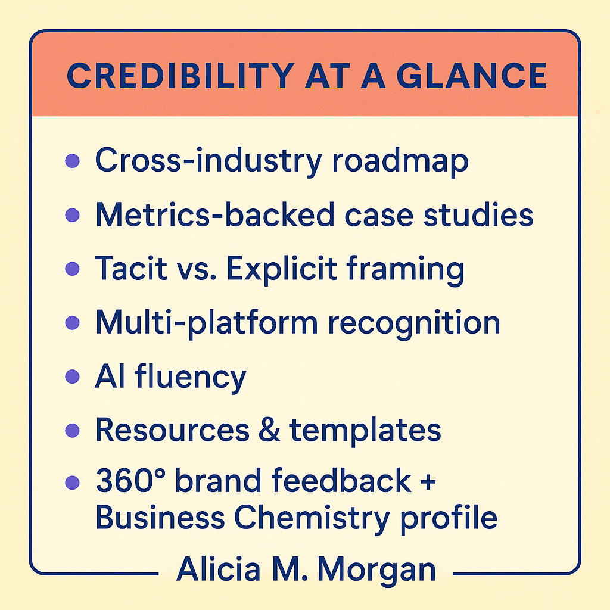

# A Practical Guide for Leading Innovation Across Sectors

> 🎤 **Featured Presentation | November 16-17, 2025**  
> **A Playbook for Leading Technology and Innovation in Traditional Environments**  
> 2025 Executive Women in Texas Government (EWTG) Annual Professional Development Conference  
> Kalahari Resorts and Convention, Round Rock, TX
> 
> **Workshop Sponsored by: IBM**
> 
> 📂 **[Access Presentation Materials →](./presentations/2025-11-EWTG-Conference/)**  
> Slides, handouts, and practical frameworks from the session

👋 **Welcome**

This playbook grew out of my 15-plus year journey from traditional PM work in technical environments to innovation leadership across nonprofits, education, and enterprise organizations. In this context, PM includes both structured project execution and strategic program leadership, often adjacent to product and operations management. It reflects the shift from being a risk-averse engineer to becoming more risk-tolerant, navigating multiple risk attitudes, and stepping across industries as an independent consultant and innovation leader. Designed to help project managers, program leaders, innovation leaders, and cross-functional teams build from structure into adaptive agility without losing clarity or execution discipline, this repo captures the principles, pivots, and lessons learned through 2025. Starting in 2026, it will remain static as a snapshot of that journey and the foundation it created for the work I do next.
>🔍 A cross-industry PM requires fluency in both explicit knowledge (formal methods, strategic frameworks) and tacit knowledge — the kind learned through lived experience, timing, communication, and decision-making across complex, real-world settings. This playbook includes both, grounded in a lived cross-sector journey, mapped out in the companion [Cross-Industry PM Career Roadmap](https://github.com/users/AliciaMMorgan/projects/2/views/1).

> This open-source playbook is hosted on GitHub and serves as a career-spanning archive — part roadmap, part reflection — that captures the principles, pivots, and practical tools behind cross-industry leadership.

### 👇 Credibility at a Glance

  

📇 **About Me**

I'm Alicia M. Morgan—a 15+ years **award-winning** PMP-certified project/program strategist with a foundation in aerospace and industrial engineering. I began my career leading technical execution, lean manufacturing, and capital improvement projects in regulated, high-stakes environments. Over time, I transitioned into the nonprofit and education sectors, bringing structured thinking into more ambiguous spaces while expanding my focus on innovation, digital transformation, and strategic program design.

My work has earned national and regional recognition. I'm a 2019 **Dallas Business Journal Women in Technology Awards Advocate Honoree** and have been featured in:

- 🌐 **Project Bites Contributor (2024-present)**: Project Bites offers project managers bite-sized educational content, with each video or audio segment lasting 20 minutes. [My shared expertise includes insights](https://projectbites.com/browse/all-bites/?_bite_speakers=5171) on *Leading Innovation in Traditional Environments: Bridging Tradition and Agility*, and *Agile and Adaptive Leadership*

- 🌀 **2024 AgileCon (International Institute for Learning)**: Speaker on *Strategic Yet Agile: Leading with Innovation* and [*featured contributor on website blog*](https://blog.iil.com/strategic-yet-agile-leading-with-innovation/)

- 🧠 **2023 PMI Webinar**: Presenter of [*Empathetic Leadership: A Key Approach to Effective Change Management* (20K+ views, 4★+ rating)](https://www.projectmanagement.com/videos/877046/empathetic-leadership--a-key-approach-to-effective-change-management-#_)

- 🎤 **2023 WE23 Conference**: Inspirational Insight Sessions Speaker on [*Strategic Leadership: Empowering Teams to Win*](https://youtu.be/5RlDCOTRQHA?si=0hI9VR8N5aT8Ic9C)

- 🎤 **2017 TEDx Plano Speaker**: Keynote on growth mindset, embracing failure, and inclusion [*(8K+ views)* (View Here)](https://youtu.be/6ayGGbMnvI8?si=6xLnzwh1X33Z2iCr)

- 🔬 **Society of Women Engineers**: [*Women Engineers You Should Know* feature (2017)](https://alltogether.swe.org/2017/10/women-engineers-you-should-know-alicia-morgan/) and *2019 WE Local Engaged Advocate K-12 Educator Honoree*

- 📘 **PM World Journal**: [Featured](https://pmworldlibrary.net/authors/alicia-morgan/) for global project and program management insights

- 🌐 **National Informal STEM Education (NISE) Network**: [*Featured article*](https://www.nisenet.org/blog/post/partner-highlight-frontiers-flight-museum-dallas-texas-celebrates-50th-anniversary-moon) for innovation in science and education engagement

- 💼 **Crain's Chicago Business**: [*Featured article*](https://www.chicagobusiness.com/article/20180522/OPINION/180529971/why-gen-x-leaders-are-critical-to-success) on cross-sector and generational leadership

- ✅ **Certifications**:

     🎯 PMP – Project Management Professional
     
     🚀 Atlassian Agile Project Management – Professional Certificate
     
     🤖 PMI – Practical Application of GenAI for Project Managers
     
     📊 PMI – Data Landscape of GenAI for Project Managers
     
     📈 PMI – Agile Metrics (DA Micro-Credential)
     
     🧠 Vanderbilt University – Prompt Engineering for ChatGPT
     
     📘 Microsoft Excel – Microsoft Apps & Office 2019
     
     💼 CNM Connect – Nonprofit Management Certification

These experiences underscore my ability to translate structure into strategy and scalable innovation. Whether leading from the front or facilitating from behind the scenes, I help organizations move from clarity to creativity, without losing business value along the way.

📌 **Why This Playbook?**

I created this to:
- Show how structure enables innovation, rather than blocking it.
- Offer a practical toolkit grounded in real-world applications, not theoretical concepts.
- Share lessons from leading digital transformation and strategic programs in both resource-rich and resource-constrained environments.

⸻

## 🌟 360° Leadership Feedback: Brand, Strengths & Growth in Action

As part of a commitment to reflective practice and cross-sector fluency, I completed a 360° Reach Assessment to better understand how my peers, colleagues, mentors, and collaborators perceive my leadership style and contributions across environments.

### ✨ Top Brand Attributes
- **Judge** – Trusted to weigh information with clarity, nuance, and discernment  
- **Expert** – Recognized for deep knowledge across domains  
- **Muse** – Inspires new ways of thinking and unlocks possibility  
- **Philanthropist** – Acts from purpose, integrity, and service  
- **Self-Starter** – Initiates action and builds systems from ambiguity

### 💡 Top Leadership Competencies
- **Expressing** – Clearly communicates vision, strategy, and next steps  
- **Developing** – Nurtures others’ potential and learning  
- **Solving** – Connects dots across disciplines to resolve complexity  
- **Inspiring** – Moves others into action through values and example  
- **Delivering** – Drives outcomes with accountability and structure

### 🔄 What I’m Actively Working On: Strengths in Motion: Evolving for Scaled, Cross-Industry Impact

To deepen my cross-industry fluency and agility, I’ve proactively pursued tools and practices that allow for faster iteration, real-time decision-making, and inclusive execution under ambiguity. 

For example:
- I earned an **Agile Metrics Certification** to better understand leading vs. lagging indicators and how to apply them in collaborative and complex environments.
- I’ve integrated this mindset throughout the playbook, combining clarity, adaptability, and thought leadership for creating meaningful action across sectors.
- I leverage AI agents and efficiency tools to enhance both strategic insights and tactical execution, driving critical success factors effectively.
  
---

### 🧠What Guides My Thinking: Business Chemistry®

Based on research by Deloitte, Business Chemistry is a framework designed to help teams collaborate more effectively by recognizing different working styles. The four types—Driver, Guardian, Pioneer, and Integrator—each offer distinct strengths in leadership, innovation, and execution.

According to Deloitte’s Business Chemistry®, I am a primary Driver and secondary Guardian. This unique pairing shapes how I lead transformation across traditional and emerging environments:

- 🚗 As a **Driver**, I’m structured, outcome-oriented, and energized by complex service. I cut through ambiguity and deliver results. I also bring a unique, empathic leadership style, allowing me to lead with both engineering precision and emotional intelligence—ideal for bridging innovation with accountability.
- 🛡️ As a **Guardian**, I value precision, risk-awareness, and structure—essential traits for navigating regulated, high-stakes, or legacy systems. I’m methodical, dependable, and lead with care.
     What sets me apart from many Guardians is a strong networking orientation, a deep appreciation for diverse skill sets, and the ability to infuse creative thinking, key to building trust across silos and driving collaboration in complex environments.

🔄 In contrast, Pioneers thrive on brainstorming and rapid ideation, while Integrators focus on team cohesion and emotional insight. I collaborate effectively by bringing structure to vision and momentum to consensus.

🎯 **Why it matters**: This Driver–Guardian combo allows me to align people, systems, and innovation. Whether building out new programs or scaling proven solutions, I apply the discipline of a PMP, the logic of an engineer, and the curiosity of an innovator.

*(Snapshot insights from the report) 

#### 🚗 Driver Snapshot
 

#### 🛡️ Guardian Snapshot
 

---

# 🔧 Part 1: The Foundation (Traditional Project Management)

This section outlines the **traditional PM practices, frameworks, and toolsets** that shaped the foundation of my approach, anchoring my transition into modern, hybrid, and innovation-driven methodologies.

### 🏗️ Core Concepts

* **Project Lifecycle**
  *Initiation → Planning → Execution → Monitoring → Closure*
  Practiced and reinforced through over **30 capital projects for over 6 years(2007-2013)** supporting mission-critical manufacturing initiatives.

* **Governance & Roles**

  * Defined **RACI charts**, stakeholder engagement plans, and escalation protocols
  * Direct sponsorship from senior leadership (engineering, ops, facilities, finance)

* **Methodologies & Tools**

  * **Waterfall & Early Hybrid** approaches
  * Tools included:
    ▪️ Microsoft Project (Gantt + dependency mgmt)
    ▪️ Excel (budget reporting, status dashboards, risk logs)
    ▪️ Smartsheet (collaboration where allowed)
  * **Factory-floor visual boards** (Kanban, throughput tracking)

### 📌 Featured Example

👉[Raytheon Factory Rearrangement Case Study](https://github.com/AliciaMMorgan/innovation-in-action/tree/main/raytheon-factory-rearrangement)

> Led end-to-end execution as sole Capital Projects Manager—delivering a \$2.5M initiative in under 6 months, generating \$3.2M in cost savings and 20,000+ labor hours avoided.

**Traditional PM fundamentals showcased:**

* Full lifecycle accountability
* Asset request submission + capital ROI modeling
* Procurement coordination + stakeholder alignment
* Floor redesign, workstation ergonomics, and value stream mapping
* Execution under compressed timelines with <1% unplanned downtime

🧠 *This project exemplifies the rigor and discipline foundational to my PM development, providing a strong launchpad for modern project leadership across industries.*

---

⸻

# 🌉 Part 2: Bridging into Innovation (Cross-Sector Adaptability)

**🌱 Early Transition & Foundation (2012–2013)**  
- Began nonprofit board volunteering while still in corporate  
- Focused on youth STEM education and community outreach  
- Built foundational governance and leadership skills  

**🎯 Formal Program Leadership Development (2014–2017)** 
- Earned Nonprofit Management Certificate
- Led nonprofit youth programs emphasizing career readiness  
- Developed board leadership pipelines and program strategies  
- Bridged technical skills with human-centered facilitation  

**🛠️ Tools & Approach**  
- Used **Excel** for early data research and workforce analysis  
- Relied on **Google Drive** for collaboration and document sharing  
- Applied Innovator’s DNA principles: observing, associating, questioning, experimenting, networking

**💻 Digital Transformation Highlight** 

🧠 Senior Researcher & Facilitator – Texas Regional STEM Degree Accelerator (North Texas Region)

As a **Senior Researcher and Vertical Team Facilitator at Dallas College** for the Texas Regional STEM Degree Accelerator (TRSDA), I supported the co-design of regional STEM pathways by bringing together K–12 educators, higher education leaders, and employers. This three-year initiative aimed to boost student **engagement, retention, and success** by aligning instruction with real-world industry needs.

🎯 Our work surfaced key skill gaps—like communication, collaboration, and career awareness—and we co-developed instructional strategies across math, CS, IT, physics, and engineering. These insights directly informed the **STEM Insight Digital Transformation Project**, where I led **user research, data-informed design, and cross-functional facilitation**. This platform became a model for how digital tools can **bridge education and workforce systems** at scale.

🔗 👉 [Project Results Summary (PDF)](https://drive.google.com/file/d/1Shh4i4ues059-bEusGyYEQpWgNx3jY9_/view?usp=sharing)  

🌐 👉 [STEM Insight Platform](https://www.steminsight.org/Pages/default.aspx) 

🔗 👉 [Outcome Action Guide College and Workforce Readiness](https://drive.google.com/file/d/1i4Q6nfXKlHCtP4GBHzhqcCT4TF3u2SVz/view?usp=drive_link)

**🚩 Other Highlights** 
- Impacted 3 mission-aligned organizations  
- Supported 12+ youth-centered and career-readiness programs  
- Advanced governance redesign and leadership pipelines  

**🔗 Related Work** 
For detailed insights, see the full case study:  
👉 [Innovation Nonprofit Leadership Platform](https://github.com/AliciaMMorgan/Innovation-In-Action/tree/main/innovationnet-nonprofit-leadership)

⸻

# Part 3: Innovation in Action (Agility in Ambiguity)

These resources show how cross-industry project and program management come to life in real-world, ambiguous, and high-stakes settings. This section is built around lived case studies, frameworks in motion, and adaptive execution across environments.

**Executive Nonprofit Leadership(2017-2020)**  
- Led strategic education and community programs serving 45,000+ students, built scalable models, and secured formal state certifications.  
- Directed multi-million-dollar budgets, improved operational efficiency by 25%, and partnered across 100+ institutions.

**Consulting & PMP Credentialing(2020-Present)** 
- Earned PMP certification focused on agile leadership and business value delivery.  
- Facilitate Agile retrospectives, stakeholder engagement, and continuous improvement in complex environments.  
- Speaker at PMI global and chapter events on empathetic leadership, innovation in traditional sectors, and strategic power skills.

**Curatorial Leadership & Event-Curation Accomplishments**
- [Curatorial Leadership Accomplishments](https://github.com/AliciaMMorgan/cross-industry-pm-playbook/blob/main/Curatorial-Leadership.md)  
- Designing inclusive, strategic convenings across sectors — from Business Resource Groups, Community events to Nonprofit education and Museum initiatives — as a form of stakeholder
  alignment, influence, and innovation capital in action.

---

**Case Studies**

- [Nonprofit Program & Community Leadership](https://github.com/AliciaMMorgan/Innovation-In-Action/tree/main/innovationnet-nonprofit-leadership)
- [Strategic Leadership & Innovation Consulting](https://github.com/AliciaMMorgan/Innovation-In-Action/tree/main/strategic-leadership-and-innovation)
  
⸻

🤖 **AI Fluency & Intelligent Tools** 

As an innovation leader, I actively integrate AI into my daily workflow—not as a novelty, but as a key collaborator in elevating communication, clarity, and execution. I use tools like **ChatGPT**, **Claude**, **Perplexity**, and **Microsoft 365 Copilot** to fine-tune messaging, build presentations, and streamline knowledge transfer across teams. These agents help me think faster, plan smarter, and communicate with intention.

I also leverage:

- 📋 **Meeting Support**: AI for real-time transcription, summarization, and action item capture  
- 🧠 **Presentation Design**: Copilot and Designer tools for structuring story flow, visuals, and delivery pacing  
- 🗣️ **Communication Coaching**: Microsoft Speaker Coach for tone, timing, accessibility, and presence  
- 🧾 **Document Review**: Drafting and refining strategies, risk logs, and stakeholder briefs with AI as a writing partner  
- 🧮 **Data Framing**: Using AI to translate complexity into visual dashboards or simplified updates
- 📚 **Research & Strategy Intelligence**: I use **Perplexity AI** to surface sourced insights, compare perspectives, and identify relevant trends—enabling faster, clearer decision-making in dynamic contexts
- 🎨 **Visual Storytelling**: Canva (with Magic Design and AI-powered brand kits) to create compelling, on-brand graphics that accelerate alignment and engagement

📂 Want a deeper dive into how I use AI across leadership, execution, and storytelling?

🔗 Explore the AI Fluency Folder →[AI-Fluency](https://github.com/AliciaMMorgan/cross-industry-pm-playbook/tree/main/AI-Tool-Fluency)

Favorite tools include:  
**ChatGPT**, **Claude**, **Microsoft 365 Copilot**, **GitHub Copilot**, **OneDrive**, **Google Drive**,  **Perplexity**, **Gemini**, **SharePoint**, **Canva**

These agents are more than tools—they extend my thinking. They allow me to operate at scale while preserving the empathy and strategy required for real impact.

⸻

🤝 **Virtual Collaboration & Meeting Intelligence**

AI isn’t just embedded in my documents—it’s part of how I show up in the room, even virtually. I strategically use video conferencing platforms with built-in transcription and intelligence features to ensure meetings are efficient, inclusive, and actionable.

I rely on:

  - 💬 **Google Meet**: Real-time captions and transcripts that support accessibility and accurate note-taking across hybrid teams
 - 🎥 **Zoom**: Smart summaries, chaptering, and AI-generated action items that help distill long conversations into next steps
 - 🏢 **Microsoft Teams**: Intelligent recap features that flag key discussion points, assign tasks, and surface follow-ups directly in the chat thread
 - 📝 **Otter.ai Integration**: Seamless syncing with calendar invites and Zoom for capturing searchable transcripts and collaborative meeting notes
 - 🔄 **Cross-Platform Sync**: Exporting summaries into OneNote, SharePoint, or project boards to preserve decisions and track accountability

These tools do more than just record—they create continuity, reduce ambiguity, and free up mental bandwidth for deeper thinking and engagement.

⸻

📊 **Data Fluency & Cross-Functional Collaboration**

As an innovation leader and program strategist, I recognize that **data isn’t just numbers—it’s narrative power**.

▪️ I partner with data engineers, analysts, and IT leaders to ensure project outcomes are aligned with business value and measurable impact.

▪️ I collaborate across enterprise environments that leverage **data lakes**—centralized repositories of structured and unstructured data—to enable smarter decision-making.

▪️ I actively lead initiatives where **Power BI**, **Excel**, and stakeholder insight intersect to deliver clarity and action.

▪️ My role is to ensure the **right questions are being asked**, the **right stakeholders are engaged**, and the **data tells a story** that leads to action.

When structured thinking meets strategic storytelling—**innovation scales.**

⸻

📘 **Resources & Templates**

🔗 [Cross-Industry PM Career Roadmap(GitHub Project Board)](https://github.com/users/AliciaMMorgan/projects/2) – A visual companion to this playbook, showing how to pivot across sectors, build credibility, and lead across industries.

🔗 Project Charter Template  
🔗 Stakeholder Engagement Checklist  
🔗 Risk Log  
🔗 Sample Retrospective Summary 

📘 **Reading List**

  [Innovation and Leadership Reading List](https://github.com/AliciaMMorgan/cross-industry-pm-playbook/blob/main/Innovation_Leadership_Reading_List.md)

⸻

📈 **KPIs**
- What success looks like: delivery and adoption

⸻

## 🔭 What’s Next: Working in Innovation Environments to Bridge the Gap

This playbook supports my next step: securing leadership roles that merge technical depth, strategic execution, and systems-level thinking across traditional and emerging environments. My focus is on opportunities that value:

- Translating ambiguity into structured action plans  
- Bridging cross-sector insights into enterprise impact  
- Designing psychologically safe, inclusive environments for innovation 
- Advancing tech-informed decision-making with clarity and accountability  

Whether inside established institutions or fast-moving organizations, I’m committed to helping teams **move from strategy to story to execution** — building cultures where continuous learning, feedback, and empowered problem-solving thrive.

This playbook will continue evolving as a **living artifact** of that work. 

---

---

## ✅ Lessons Learned from the Field

Want to understand the mindsets and principles from real-world experiences?

📌 These lessons dive into the real-world challenges of pivoting across industries — like navigating trust, rebuilding influence, learning to speak multiple stakeholder “languages,” and measuring business value in unfamiliar sectors.

🧠 They’re grounded in the same cross-industry mindset that fuels this playbook.

🔗 [Explore the Lessons Learned →](lessons-learned/README.md)

---

⸻

📬 Connect With Me

For speaking invitations, leadership opportunities, or strategic collaborations, please refer to my website for more information.

🌐 https://aliciammorgan.com/  
🎙️ Speaker • PM Strategist • Innovation Leader

⸻
## 📄 License

This work is licensed under the [Creative Commons Attribution 4.0 International License (CC BY 4.0)](https://creativecommons.org/licenses/by/4.0/). 

You are free to:

- Share — copy and redistribute the material in any medium or format
- Adapt — remix, transform, and build upon the material for any purpose, even commercially

**Under the following terms:**

- **Attribution** — You must give appropriate credit, provide a link to the license, and indicate if changes were made.  
  Suggested attribution:  
  _"Based on work by Alicia M. Morgan – [github.com/AliciaMMorgan](https://github.com/AliciaMMorgan)"_

For full license details, visit [creativecommons.org/licenses/by/4.0](https://creativecommons.org/licenses/by/4.0/).

